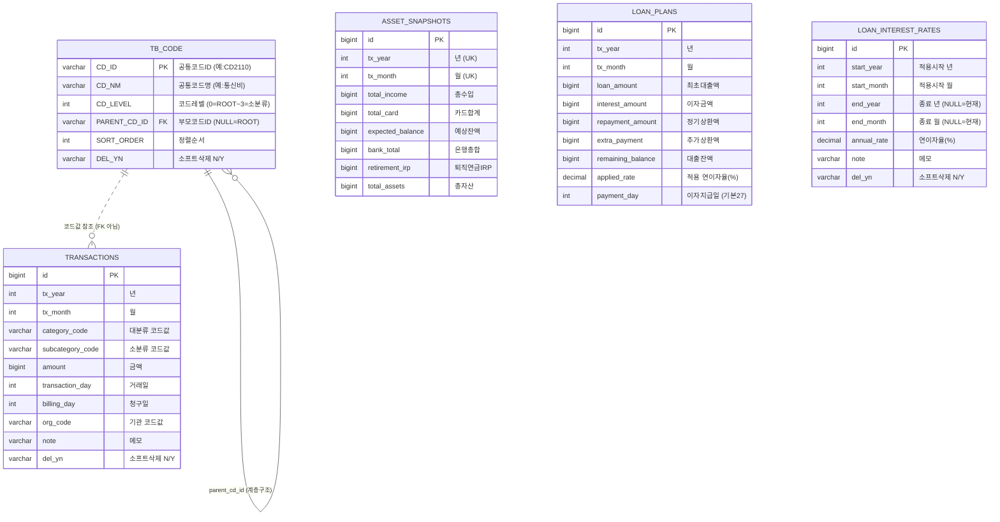

# 재정관리 앱 - 데이터 모델 (ERD)

> JPA 엔티티 기반 ERD. 엔티티 변경 시 이 문서도 함께 업데이트하세요.
> GitHub에서 아래 다이어그램이 자동으로 렌더링됩니다.

## 전체 ERD



---

## 테이블 설명

### 1. `TB_CODE` — 공통코드 (중심 테이블)
모든 분류값을 코드로 관리. **자기참조(self-reference)** 계층 구조.

**코드체계**: `CD` + 4자리 `[대분류][중분류][소분류][예비]`
- `CD0000` = ROOT (L0)
- `CD1000` = 소득 (L1) / `CD2100` = 고정비용 (L2) / `CD2110` = 통신비 (L3)

```
CD0000 ROOT
├── CD1000 소득
│   ├── CD1100 급여 / CD1200 이자소득 / CD1300 배당소득
├── CD2000 비용
│   ├── CD2100 고정비용 → 통신비 / 관리비·세금 / 보험비 / 정기구독
│   └── CD2200 가변비용 → 카드값 / 기타
├── CD3000 기관분류
│   ├── CD3100 카드사 → 삼성/신한/현대/국민/비씨/하나
│   ├── CD3200 보험사 → 삼성화재/현대해상/동양생명/DB손해보험
│   ├── CD3300 은행   → 우리/신한/오케이저축/대신저축/새마을금고
│   └── CD3400 증권사 → 미래에셋/토스
└── CD4000 투자
    ├── CD4100 배당투자 / CD4200 퇴직연금
```

### 2. `transactions` — 거래내역
월별 소득/지출 내역. 분류·기관을 **코드값(문자열)** 으로 참조.

### 3. `asset_snapshots` — 월별 자산 스냅샷
`(tx_year, tx_month)` 복합 유니크. 월별 자산 현황 한 행.

### 4. `loan_plans` — 대출 월별 상환계획
`applied_rate`에 그 달 적용 이자율을 **스냅샷처럼 보존** (이자율이 나중에 바뀌어도 과거 기록 유지).

### 5. `loan_interest_rates` — 이자율 히스토리
구간(`start ~ end`)별 연이자율. `end`가 NULL이면 현재까지 유효.

---

## 관계 특징 (중요)

⚠️ **이 모델은 실제 외래키(FK) 제약을 걸지 않은 "논리적 참조" 구조입니다.**

| 관계 | 방식 | 이유 |
|------|------|------|
| `TB_CODE` → `TB_CODE` | `PARENT_CD_ID`로 자기참조 | 계층 구조 표현 |
| `transactions` → `TB_CODE` | `category_code` 등 **코드값(CD_ID)** 으로 참조 | 코드 추가/삭제 유연성, 소프트삭제와 궁합 |

> **장점**: 코드를 소프트삭제(`del_yn='Y'`)해도 기존 거래내역이 깨지지 않음
> **주의**: DB가 무결성을 강제하지 않으므로, 코드값 존재 검증은 애플리케이션 레이어 책임
